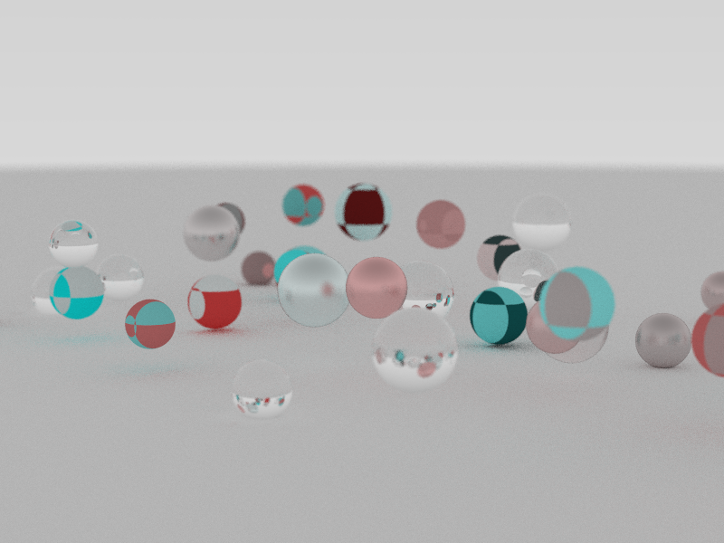
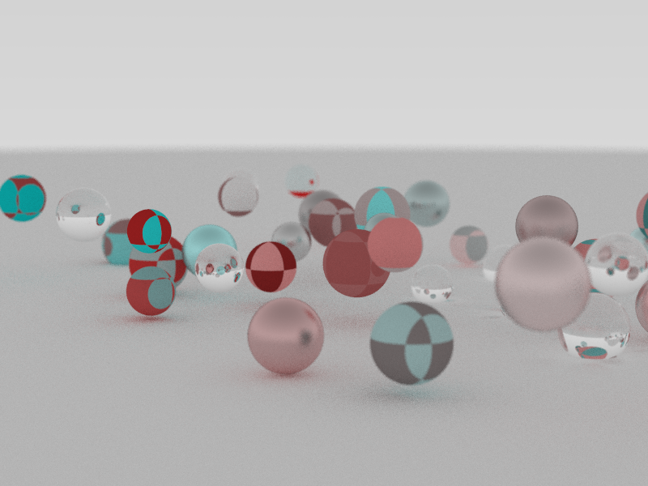
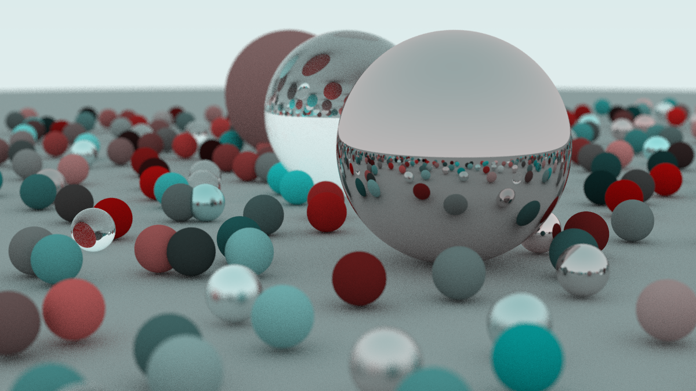

# CS418 4-Credit Project: Ray-Tracer Implementation (C++)
------
## Usage
1. <em>Simply run executable with passing parameters [# of sphere, output file name, max recursion depth]</em> <br>
<strong>Example:&nbsp; ./ray_tracer.exe &nbsp; 20 &nbsp;img.ppm &nbsp; 50   </strong>
2. <em>Easy to compile!</em> <br>
<strong>g++ -std==c++11 main.cpp</strong>
------
## Features:
```
1. Random scene with sphere-ray intersection
2. Positional camera (configure with eyePt / viewDir / up)
3. Three Material types (Diffuse, Metal, Dielectrics)
4. BVH Implementation (O(lgN) algorithm is substantially faster!!)
5. Simple Checker Texture
```
------
## Example
```Demo Scene```<br>
 <br>
```Using BVH```<br>
 <br>
```Run random_scene example from the book on my implementation (I gotta say it's awesome!!)```


------
## Reference: [Peter Shirley’s books on ray tracing](https://raytracing.github.io/books/RayTracingTheNextWeek.html#overview)
